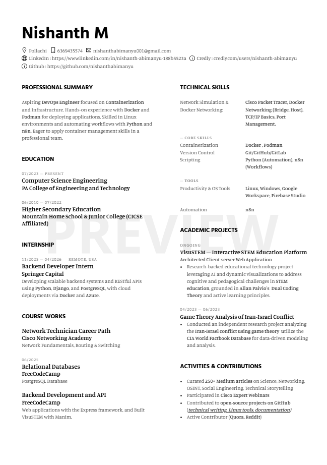

# Hi there, I'm Nishanth M! 👋

**Aspiring DevOps Engineer | Containerization & Infrastructure Enthusiast**

---

## 👨‍💻 Professional Summary

Aspiring DevOps Engineer focused on **Containerization** and **Infrastructure**. Hands-on experience with **Docker** and **Podman** for deploying applications. Skilled in **Linux** environments and automating workflows with **Python** and **n8n**. Eager to apply container management skills in a professional team.

---

## 🛠 Tech Stack

### Infrastructure & Containerization

### Languages & Frameworks

### Tools

---

## 📊 GitHub Stats

---

## 📄 Resume

---

## 💼 Experience

### **Backend Developer Intern** @ Springer Capital
*Remote, USA | Nov 2025 – Apr 2026*
* Developing scalable backend systems and RESTful APIs using **Python**, **Django**, and **PostgreSQL**.
* Managing cloud deployments via **Docker** and **Azure**.

---

## 🚀 Academic Projects

### **VisuSTEM – Interactive STEM Education Platform**
*Ongoing*
* Architected a **Client-server Web Application**.
* Research-backed educational technology project leveraging AI and dynamic visualizations.
* Addresses cognitive challenges in STEM education using **Allan Paivio's Dual Coding Theory**.

### **Game Theory Analysis of Iran-Israel Conflict**
*Apr 2023 – Jun 2023*
* Conducted independent research analyzing conflict using **Game Theory**.
* Utilized the **CIA World Factbook Database** for data-driven modeling.

---

## 🎓 Education

**Computer Science Engineering**  
*PA College of Engineering and Technology | Jul 2023 – Present*

**Higher Secondary Education**  
*Mountain Home School & Junior College (CICSE Affiliated) | Jun 2010 – Jul 2022*

---

## 📜 Certifications

*   🏆 **Network Technician Career Path** - Cisco Networking Academy
*   🏆 **Relational Databases** - FreeCodeCamp
*   🏆 **Backend Development and API** - FreeCodeCamp

---

## 🌟 Contributions

*   ✍️ Curated **250+ Medium articles** on Science, Networking, OSINT, and Tech.
*   🐧 Contributed to **open-source projects** (Linux tools, documentation).
*   🗣️ Active on **Quora** & **Reddit**.