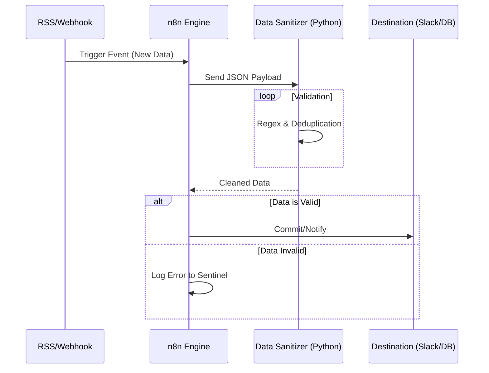

# 🏗️ Private System Architecture & Portfolio

Since much of my work is in private repositories or deployed in closed communities (Discord), this document provides a high-level technical overview of the systems I have architected and maintained.

---

## 1. Distributed Discord Bot Infrastructure

**Objective:** Architected a highly available, sharded Discord bot ecosystem capable of handling high-volume event streams from thousands of users.

### 🧩 Architecture Diagram

```mermaid
graph TD
    User[Discord User] -->|Interaction| Gateway[Discord Gateway]
    Gateway -->|WebSocket Event| ShardMan[Sharding Manager (Node.js)]
    
    subgraph "Core Infrastructure"
        ShardMan -->|Distributes| BotCluster1[Worker Cluster 1]
        ShardMan -->|Distributes| BotCluster2[Worker Cluster 2]
        
        BotCluster1 -->|Write/Read| Redis[(Redis Cache)]
        BotCluster2 -->|Write/Read| Redis
        
        BotCluster1 -->|Persistent Data| Postgres[(PostgreSQL DB)]
        BotCluster2 -->|Persistent Data| Postgres
    end
    
    subgraph "Microservices Layer"
        API[Internal REST API] -->|Auth Check| Postgres
        BotCluster1 -->|HTTP Req| API
        Ext[External Web Dashboard] -->|HTTP Req| API
    end
```

### 🛠️ Technical Stack
*   **Language:** Python (discord.py) & Node.js
*   **Database:** PostgreSQL (Primary), Redis (Hot Cache/Rate Limiting)
*   **Deployment:** Docker Swarm / Podman
*   **Monitoring:** Grafana + Prometheus (Metrics: Latency, Shard Health)

---

## 2. n8n Automation Pipeline

**Objective:** reliable, self-healing automation workflows for data ingestion and OSINT tasks.

### 🔄 Workflow Logic



### 💡 Key Implementation Details
*   **Custom Nodes:** Built custom n8n nodes in TypeScript for specific internal APIs.
*   **Queue Management:** Implemented RabbitMQ to buffer bursts of incoming webhooks, preventing workflow throttling.
*   **Security:** Secrets managed via Docker Secrets, never hardcoded.

---

## 3. Secure File Transfer Microservice

**Objective:** A secure, ephemeral file sharing service used for internal team transfers.

*   **Encryption:** AES-256 encryption at rest.
*   **Lifecycle:** Auto-deletion (TTL) implementation using Redis Keyspace Notifications.
*   **Storage:** S3-compatible object storage (MinIO) for scalability.

> *Note: Codebases for these systems are private to protect intellectual property and community security.*
